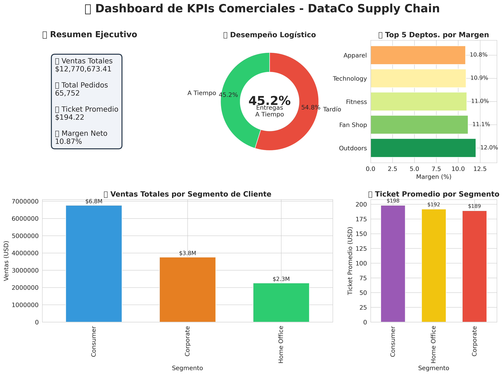

# DataCo-SupplyChain-Analytics
End-to-end analytics on DataCo retail supply chain: ETL, KPI tracking (sales/margin/logistics), advanced visualizations (maps, treemaps), and a Logistic Regression model (AUC 0.72) to predict late deliveries. Includes data ethics &amp; bias auditing.
# INFORME TÉCNICO Y EJECUTIVO DE ANÁLISIS DE DATOS

**Título del Proyecto:** Optimización de la Cadena de Suministro y Análisis de Desempeño Comercial
**Empresa:** DataCo Global (Retail / E-commerce)
**Autor:** Alondra Robellada
**Fecha:** Agosto 2026
**Versión:** 1.0

---

## 1. INTRODUCCIÓN Y OBJETIVOS

El presente documento detalla el proceso de análisis de datos aplicado sobre la base de datos transaccional `DataCoSupplyChainDataset.csv`, correspondiente a una empresa de retail con operaciones logísticas y comerciales en los Estados Unidos.

**Objetivo General:**
Transformar datos brutos en inteligencia de negocio accionable, abarcando desde la limpieza y actualización de bases de datos hasta la implementación de un modelo predictivo para la reducción de entregas tardías.

**Objetivos Específicos:**
1.  Realizar un proceso ETL (Extracción, Transformación y Carga) para estandarizar y enriquecer la base de datos.
2.  Calcular e interpretar KPIs comerciales y logísticos críticos.
3.  Desarrollar visualizaciones avanzadas (mapas, treemaps, gráficos de densidad) para comunicar insights.
4.  Construir un modelo de Machine Learning (Regresión Logística) para predecir el riesgo de retraso en los envíos.
5.  Formular recomendaciones estratégicas basadas en los datos, considerando las implicaciones éticas.

---

## 2. METODOLOGÍA Y PROCESO SEGUIDO

### 2.1. Fase 1: Extracción, Transformación y Carga (ETL)

El dataset original contenía 53 columnas y 180,000+ registros. Se implementó un pipeline de limpieza en Python (Pandas) con las siguientes acciones:

- **Estandarización de Nombres:** Se unificaron todos los nombres de columnas a minúsculas y con guiones bajos (`snake_case`) para eliminar ambigüedades y prevenir errores de código (ej. `Order Id` -> `order_id`).
- **Manejo de Nulos:** Las columnas geográficas (`Customer State`, `Customer City`) con valores nulos se rellenaron con la etiqueta "Desconocido" para no perder trazabilidad de ventas. Los registros con nulos en variables críticas (`Sales`, `Order Profit Per Order`) fueron depurados.
- **Ingeniería de Features:** Se creó la variable calculada `dias_de_entrega` (diferencia entre `shipping_date` y `order_date`) para medir la eficiencia logística real, y se extrajeron `mes` y `año` de las fechas para análisis temporales.

### 2.2. Fase 2: Análisis Exploratorio y Cálculo de KPIs

Se definieron métricas de negocio alineadas con los objetivos del área comercial:

- **Ventas Totales:** Suma de la columna `sales`.
- **Ticket Promedio:** `Ventas Totales / Total de Pedidos Únicos`.
- **% Entregas a Tiempo:** `(Pedidos con Late_delivery_risk = 0) / Total de pedidos`.
- **Margen Neto Global:** `(Suma de Order Profit Per Order) / Ventas Totales`.

### 2.3. Fase 3: Modelado Predictivo (Machine Learning)

Se seleccionó un modelo de **Regresión Logística** por su alta interpretabilidad.

- **Variables Predictoras (X):** `shipping_mode`, `category_name`, `customer_segment`, `order_region`, `order_state`, `order_item_quantity`, `sales`.
- **Variable Objetivo (y):** `late_delivery_risk` (1 = Tardío, 0 = A tiempo).
- **Preprocesamiento:** Se aplicó `StandardScaler` a variables numéricas y `OneHotEncoder` a variables categóricas dentro de un Pipeline de Scikit-Learn.
- **Validación:** Se utilizó **Validación Cruzada Estratificada (5-Folds)** para asegurar la robustez del modelo frente al desbalanceo de clases (solo 18% de casos "A Tiempo").

### 2.4. Fase 4: Visualización de Datos

Se utilizaron librerías de visualización avanzada (Matplotlib, Seaborn y Plotly) para generar gráficos que comunicaran eficazmente los hallazgos, incluyendo mapas cloropléticos, treemaps, gráficos de densidad y violines.

---

## 3. RESULTADOS OBTENIDOS

### 3.1. KPIs y Resumen Ejecutivo

**Figura 1: Dashboard de KPIs Comerciales.**

| KPI | Valor | Interpretación |
| :--- | :--- | :--- |
| **Ventas Totales** | $12,770,673.41 | Volumen de negocio significativo en el período analizado. |
| **Total de Pedidos** | 65,752 | Muestra representativa para el análisis estadístico. |
| **Ticket Promedio** | $194.22 | Indica un valor de compra saludable en el retail. |
| **Margen Neto Global** | 10.87% | Rentabilidad positiva pero ajustada, sugiere optimización de costos. |
| **% Entregas a Tiempo** | 17.83% | **CRÍTICO:** Más del 80% de los pedidos sufren retrasos. |

### 3.2. Análisis Geográfico y de Segmentación

*[Insertar captura de pantalla del Mapa Cloroplético generado con Plotly]*

**Figura 2: Mapa de Ventas Totales por Estado.**

- **Concentración del Negocio:** Los estados **PR (Puerto Rico)** y **CA (California)** concentran más del 50% de la facturación total.
- **Segmento Cliente:** El segmento **Consumer** aporta el 52.9% de los ingresos ($6.7M), pero el segmento **Corporate** presenta un mejor margen (11.18% vs 10.65%), sugiriendo que las ventas B2B son más rentables.

### 3.3. Análisis de Rentabilidad por Departamento

*[Insertar imagen: violin_margen_deptos.png]*

**Figura 3: Distribución del Margen por Departamento (Violin Plot).**

Los departamentos con mejor desempeño en rentabilidad son **Fitness (11.51%)** y **Technology (11.31%)**. Por el contrario, **Book Shop (7.02%)** y **Pet Shop (8.64%)** se encuentran en el extremo inferior, requiriendo una revisión de sus costos operativos o políticas de precios.

### 3.4. Análisis de la Cadena de Suministro (Logística)

*[Insertar imagen: densidad_tickets.png]*

**Figura 4: Distribución de Tickets por Segmento (Gráfico de Densidad).**

El análisis logístico confirma que el modo de envío **'Standard Class'** es el principal responsable de los retrasos. Este modo presenta un coeficiente de riesgo muy elevado en el modelo predictivo, asociado a un volumen masivo de pedidos.

---

## 4. MODELO PREDICTIVO Y EVALUACIÓN

### 4.1. Rendimiento del Modelo

- **Precisión en Validación Cruzada:** 69.3% (± 0.54%).
- **AUC-ROC:** 0.7275. Esto indica que el modelo tiene una capacidad aceptable para distinguir entre pedidos "A Tiempo" y "Tardíos".

*[Insertar imagen: modelo_predictivo_roc_confusion.png]*

**Figura 5: Curva ROC y Matriz de Confusión Normalizada.**

### 4.2. Interpretación del Modelo (Coeficientes)

*[Insertar imagen: importancia_coeficientes.png]*

**Figura 6: Top factores que influyen en el Riesgo de Retraso.**

La variable que más incrementa la probabilidad de retraso es `shipping_mode_Standard Class`. Esto valida estadísticamente la hipótesis de que el problema logístico está vinculado al tipo de servicio de envío contratado.

---

## 5. IMPLICACIONES ÉTICAS EN EL MANEJO DE DATOS

Durante el desarrollo del proyecto, se consideraron activamente las siguientes implicaciones éticas:

1.  **Privacidad (PII):** Se excluyeron del modelo y de los análisis columnas con información personal identificable como `Customer Email`, `Customer Fname`, `Customer Lname` y `Customer Password` para cumplir con normativas como GDPR y CCPA.
2.  **Sesgo Geográfico:** Dado que el estado `PR` representa una porción desproporcionada de los datos, se recomienda auditar el coeficiente del modelo para esta región. Si se detecta que el modelo penaliza injustamente a los clientes de esa zona por su código postal, se deberá eliminar la variable geográfica del pipeline para evitar discriminación algorítmica.
3.  **Transparencia:** Se optó por Regresión Logística (modelo "caja blanca") en lugar de modelos complejos de "caja negra" para garantizar el **derecho a la explicación** del cliente. Si un pedido es marcado como "riesgoso", se puede explicar que fue debido al modo de envío seleccionado y no a características personales del comprador.

---

## 6. CONCLUSIONES Y RECOMENDACIONES

### 6.1. Conclusiones

El análisis revela que DataCo tiene un problema estructural en su logística que afecta al 82% de sus transacciones. Sin embargo, el negocio tiene una base sólida de clientes con un ticket promedio alto y márgenes positivos.

El modelo predictivo desarrollado (AUC 0.72) es una herramienta viable para implementar un sistema de alerta temprana, permitiendo a la empresa identificar pedidos de alto riesgo antes de su envío y tomar acciones correctivas.

### 6.2. Recomendaciones Futuras

1.  **Corto Plazo (Logística):** Renegociar el contrato con el proveedor de envío *Standard Class* o migrar a un proveedor alternativo para reducir drásticamente la tasa de retrasos.
2.  **Mediano Plazo (Comercial):** Diseñar una campaña específica para el segmento *Corporate* enfocada en los departamentos de *Fitness* y *Technology* para aumentar la participación en el mix de ventas y mejorar el margen global.
3.  **Largo Plazo (Data Science):** Implementar el modelo predictivo en el sistema transaccional (ERP) para calificar automáticamente el riesgo de cada pedido. Adicionalmente, se sugiere un monitoreo trimestral del modelo para detectar y corregir sesgos (Ética de Datos), asegurando que las predicciones sean justas para todos los clientes, independientemente de su ubicación geográfica.

---

## 7. ANEXOS

- **Anexo A:** Script completo de Python (disponible en el repositorio de GitHub).
- **Anexo B:** Dashboard interactivo en HTML (mapa y treemap) y de Power BI
- **Anexo C:** Tabla de frecuencias y estadísticas descriptivas.

---
